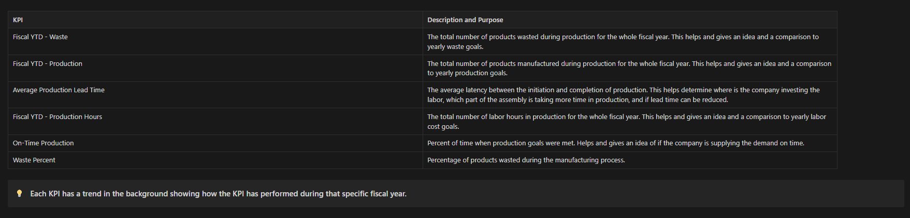
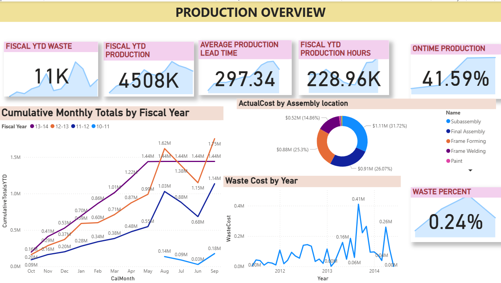
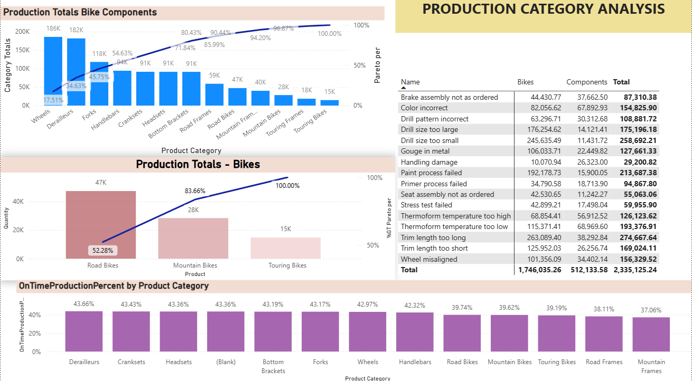
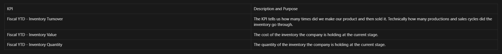

#  AdventureWorks Manufacturing & Inventory Analysis

##  Project Overview
This project presents an **end-to-end data analysis and visualization** of the manufacturing and inventory operations of **Adventure Works**, a fictional multinational bicycle manufacturing company.  
The analysis integrates data from **SQL Server**, **Python**, and **Power BI**, providing deep insights into production efficiency, category-level trends, and inventory management.

The core objective is to:
- Analyze production and inventory performance over multiple fiscal years.
- Identify bottlenecks and wastage in the production pipeline.
- Evaluate product-level turnover, cost efficiency, and stock management.
- Deliver actionable insights through interactive Power BI dashboards.

---

##  Data Source
[DATA SOURCE](https://learn.microsoft.com/en-us/sql/samples/adventureworks-install-configure?view=sql-server-ver15&tabs=ssms)

##  Data Model Overview
A custom **star schema** data model was created to improve data refresh performance and analytical flexibility.  

**Tables used in this project:**
| Table | Description |
|-------|--------------|
| `Production.Product` | Contains details of each product including cost, weight, and category. |
| `Production.ProductInventory` | Tracks product-level inventory quantities and locations. |
| `Production.ProductCategory` | Defines the product category (e.g., Bikes, Components, Clothing). |
| `Production.ProductSubcategory` | Defines subcategories under each category. |
| `Production.WorkOrder` | Contains production transactions and work order data. |
| `Production.WorkOrderRouting` | Defines the routing and scheduling of each work order. |
| `Sales.SalesOrderDetail` | Records individual item-level sales transactions. |
| `Production.ScrapReason` | Holds data on manufacturing waste and scrap causes. |
| `Calendar` | A custom date table created in Power BI using DAX for fiscal calculations. |

---

## Tools & Technologies Used
- **SQL Server** – for data extraction and relational queries  
- **Python (Jupyter Notebook)** – for preliminary data validation and exploration  
- **Power BI** – for interactive dashboard design and data storytelling  
- **DAX** – for calculated measures, fiscal time intelligence, and KPIs  
- **Git & GitHub** – for version control and project documentation  

---

##  Project Objectives
1. **Production Overview:**  
   Assess the overall manufacturing performance and efficiency.
2. **Category Analysis:**  
   Identify strong and weak performing product categories.
3. **Inventory Overview:**  
   Understand inventory movement, stock value, and turnover ratios.
4. **KPI Definitions:**  
   - Fiscal YTD Production Quantity  
   - Fiscal YTD Scrap Quantity  
   - Fiscal YTD Inventory Value  
   - Fiscal YTD Inventory Turnover  
   - Lead Time by Category  

---

## 📊 Dashboard Analysis

### 🔹 Production Analysis
This section explores **manufacturing performance** across fiscal years, showing:
- Production quantity trends
- Scrap rates
- Average production costs
- Efficiency variations across categories

**Production KPIs:**  

**Production Analysis Page:**  

---

### 🔹 Category Overview
This page focuses on **category-level performance** and highlights:
- Cost vs. production relationships
- Waste by category
- Profitability contribution by product subcategory

**Category Overview Page:**  

---

### 🔹 Inventory Overview
The **Inventory Overview** section emphasizes:
- Stock levels across locations
- Inventory turnover ratio
- Fiscal YTD inventory value
- Slow-moving and high-value products

**Inventory KPIs:**  

**Inventory Analysis Page:**  

---

## Key Insights
-Inventory Efficiency – $74.28bn tied up in 336K units; turnover ratio (~2.0–3.5) shows moderate stock movement but hints at overproduction in some periods.

-Production Mix – Road Bikes (52%) dominate output, while Wheels and Derailleurs emerge as critical cost and demand drivers.

-Operational Gaps – Long lead times (~297 days) and only 41.6% on-time order completion highlight major efficiency bottlenecks.

-Waste & Quality – Waste is minimal (0.24%), but recurring defects signal process-level quality issues.

-Cost Drivers – Final Assembly and Frame Forming processes account for the largest costs, requiring optimization.

-Trends – Production peaked in FY 2012–13, then stabilized; efficiency fluctuates year-over-year, pointing to inconsistent process control.

---

---

##  Learnings
- End-to-end data modeling from SQL to Power BI integration.
- Advanced use of DAX for custom fiscal calculations.
- Designing user-friendly, app-like dashboards with interlinked pages.
- Understanding manufacturing KPIs in real-world ERP data contexts.

